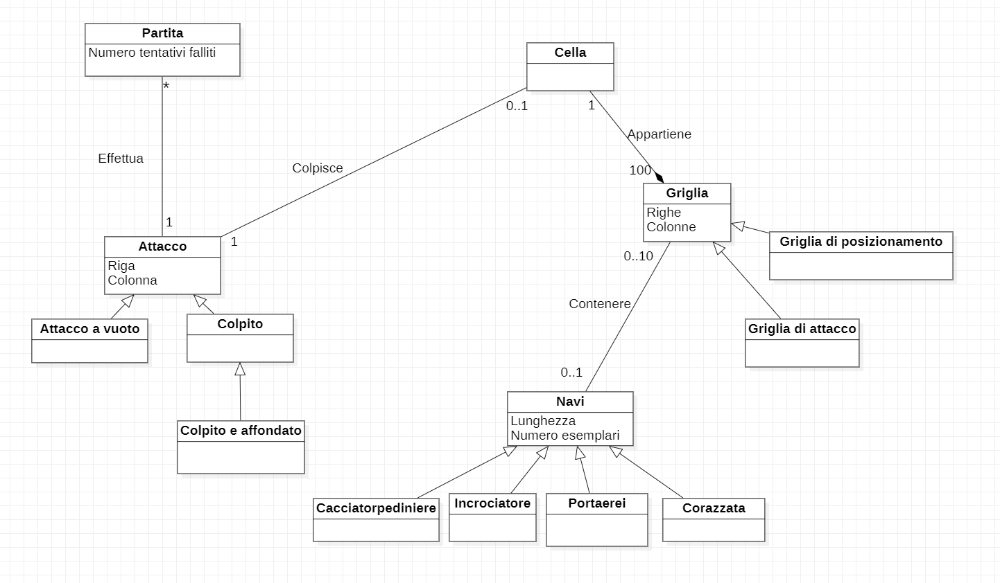
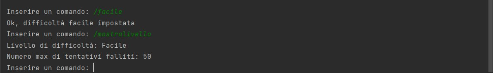
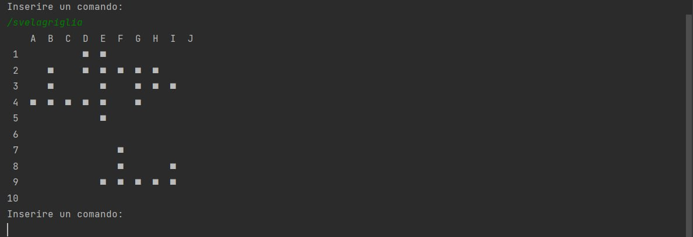

# Report

## Indice 

1. [Introduzione](#1-introduzione)
2. [Modello di dominio](#2-modello-di-dominio)
3. [Requisiti specifici](#3-requisiti-specifici)
 <br/>   3.1. [Requisiti Funzionali](#31-requisiti-funzionali)
 <br/>    3.2. [Requisiti non Funzionali](#32-requisiti-non-funzionali)
4. [System Design](#4-system-design)
5. [OO Design](#5-oo-design)
6. [Riepilogo del test](#6-riepilogo-del-test)
7. [Manuale utente](#7-manuale-utente)
8. [Processo di sviluppo e organizzazione del lavoro](#8-processo-di-sviluppo-e-organizzazione-del-lavoro)
9. [Analisi retrospettiva](#9-analisi-retrospettiva)
<br/>   9.1. [Sprint 0](#91-sprint-0)
<br/>    9.2. [Sprint 1](#92-sprint-1)

<br/>

## 1. Introduzione

Il programma usufruisce di regole simili all'omonimo gioco da tavolo "Battaglia navale": 

- Per affondare una nave è necessario colpire tutte le caselle che occupa
- Le navi possono essere posizionate orizzontalmente o verticalmente, ma non possono sovrapporsi 
- Il programma notificherà il giocatore se ha colpito o mancato una nave

Tuttavia esso differisce dall'originale in quanto, quando si fanno determinati colpi in acqua (miss/mancati), il giocatore perde comunque la partita. Il numero di tentativi è impostabile attraverso un sistema di difficoltá tramite comando. Sono presenti 3 livelli di difficoltà crescenti (facile, medio, difficile).
Il numero di navi nemiche da affrontare é 10, di grandezza variabile (minimo 2, massimo 5). 
Le navi da affondare sono di 4 tipi diversi di cui:

- Cacciatorpediniere: una nave facile da affondare ma difficile da trovare;
- Incrociatore: una nave versatile ma che comunque non riesce ad incassare troppi colpi;
- Corazzata: una nave portentosa, difficile da affondare;
- Portaerei: puo' essere colpita molte volte, ma è facile da trovare per le sue dimensioni.

## 2. Modello di dominio

<br/>



<br/>

## 3. Requisiti specifici

### 3.1 Requisiti Funzionali

Di seguito, i ***Requisiti Funzionali*** del progetto, facenti parte della *User Story*.

- *mostrare l'help con elenco comandi e regole del gioco*

  Come giocatore voglio mostrare l'help con elenco comandi.

  **Criteri di accettazione**

  Al comando ```/help```
  o invocando l'app con flag ```--help``` o ```-h```

  Il risultato è una descrizione concisa, che normalmente appare all'avvio del
  programma, seguita da una lista di comandi disponibili,
  uno per riga, come da esempio successivo:

  - gioca
  - esci
  - ...

<br/>

- *chiudere il gioco*

  Come giocatore voglio chiudere il gioco.

  **Criteri di accettazione**
  
  Al comando ```/esci```

    - l'applicazione chiede conferma
        - se la conferma è positiva, l'applicazione si chiude restituendo il controllo al sistema operativo
        - se la conferma è negativa, l'applicazione si predispone a ricevere nuovi tentativi o comandi

<br/>

- *impostare il livello di gioco per variare il numero massimo di tentativi falliti*

  Come giocatore voglio impostare il livello di gioco per variare il numero massimo di tentativi sbagliati.

  **Criteri di accettazione**
  - Al comando ```/facile```

    - l’applicazione risponde con OK e imposta a 50 il numero massimo di tentativi falliti

  - Al comando ```/medio```

    - l’applicazione risponde con OK e imposta a 30 il numero massimo di tentativi falliti

  - Al comando ```/difficile```

    - l’applicazione risponde con OK e imposta a 10 il numero massimo di tentativi falliti

<br/>

- *mostrare i tipi di nave e il numero*

  Come giocatore voglio mostrare i tipi di nave e il numero
  
  **Criteri di accettazione**

  Al comando ```/mostranavi``` l’applicazione risponde visualizzando, per ogni tipo di nave, la dimensione in quadrati e il numero di esemplari da affondare
  
  -    Cacciatorpediniere ⊠⊠ esemplari: 4
  -    Incrociatore ⊠⊠⊠ esemplari: 3 
  -    Corazzata ⊠⊠⊠⊠ esemplari: 2 
  -    Portaerei ⊠⊠⊠⊠⊠ esemplari: 1

<br/>

- *iniziare una nuova partita*

  Come giocatore voglio iniziare una nuova partita

  **Criteri di accettazione**

  Al comando ```/gioca```

    - se nessuna partita è in corso l'applicazione imposta casualmente le navi, in orizzontale o in verticale, mostra la griglia vuota e si predispone a ricevere il primo tentativo o altri comandi

<br/>

- *svelare la griglia con le navi posizionate*

  Come giocatore voglio svelare la griglia con le navi posizionate

  **Criteri di accettazione**

  Al comando ```/svelagriglia```

    - l’applicazione risponde visualizzando, una griglia 10x10, con le righe numerate da 1 a 10 e le colonne numerate da A a J, e tutte le navi posizionate

<br/>

### 3.2 Requisiti non Funzionali

Il funzionamento del software richiede:

- il container docker dell’app deve essere eseguito da terminali che supportano Unicode con encoding UTF-8 o UTF-16.

<br/>
 

## 4. System Design

## 5. OO Design

## 6. Riepilogo del test

## 7. Manuale utente

### **Situazione iniziale**

All'inizio della partita le navi vengono posizionate in modo casuale all'interno della griglia (10x10) che costituisce il campo di gioco.

La flotta è composta da 10 navi di diversa dimensione:

- Cacciatorpediniere 2 quadrati esemplari: 4 

- Incrociatore 3 quadrati esemplari: 3

- Corazzata 4 quadrati esemplari: 2 

- Portaerei 5 quadrati esemplari: 1

<br/>

Prima dell'inizio della partita il giocatore potrà scegliere il livello di difficoltà in base al quale varia in numero massimo di tentativi falliti 

<br/>

**Difficoltà:**

- Facile : 50 tentativi falliti disponibili 

- Media : 30 tentativi falliti disponibili 

- Difficile : 10 tentativi falliti disponibili 

<br/>

**Esempi di esecuzione dell'applicazione:**

<br/>


<br/>



<br/>


<br/>


<br/>


<br/>


<br/>



<br/> <br/>


### **Svolgimento**

...

## 8. Processo di sviluppo e organizzazione del lavoro

## 9. Analisi retrospettiva
	
### 9.1 Sprint 0


### 9.2 Sprint 1
